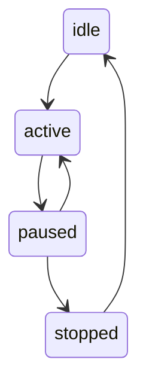
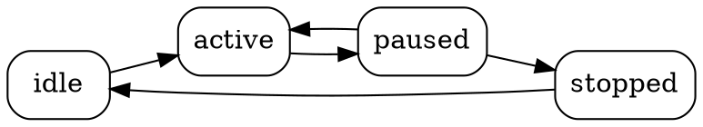
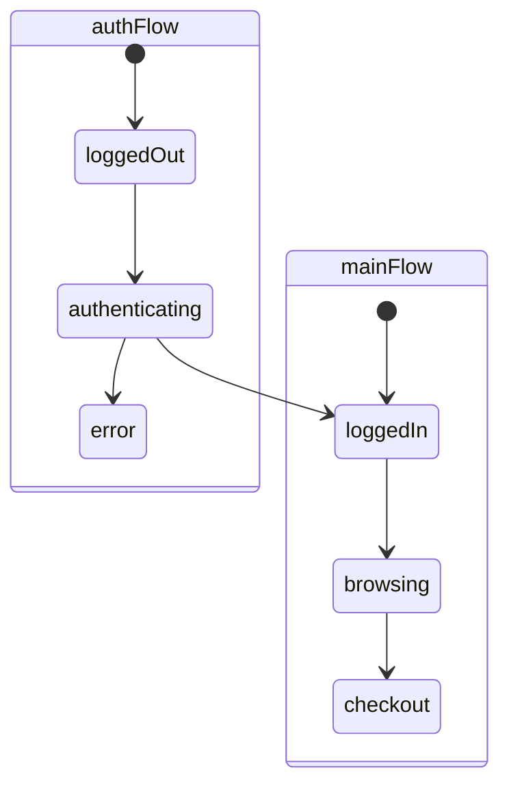
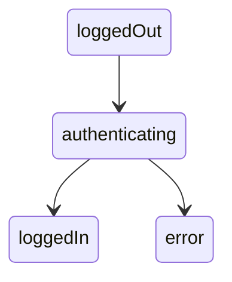

# State Machine Visualization

FluentState provides powerful visualization capabilities to help you understand, debug, and document your state machines. The visualization tools can generate diagrams in multiple formats, representing states, transitions, groups, and other elements of your state machine.

## Generating Visualizations

To generate a visualization of your state machine, use the `generateGraph` method on your FluentState instance:

```typescript
import { FluentState } from "@2toad/fluent-state";

const fs = new FluentState({
  initialState: "idle"
});

// Define some states and transitions
fs.from("idle").to("active");
fs.from("active").to("paused");
fs.from("paused").to("active");
fs.from("paused").to("stopped");
fs.from("stopped").to("idle");

// Generate a Mermaid diagram (default)
const mermaidDiagram = fs.generateGraph();

// Generate a DOT diagram
const dotDiagram = fs.generateGraph({ format: "dot" });

// Generate SVG instructions
const svgInstructions = fs.generateGraph({ format: "svg" });
```

## Output Formats

FluentState supports three output formats for visualizations:

### Mermaid

[Mermaid](https://mermaid.js.org/) is a JavaScript-based diagramming and charting tool that renders Markdown-inspired text definitions to create diagrams. It's widely supported in documentation tools, Markdown editors, and collaboration platforms.

Example Mermaid output:



### DOT (Graphviz)

[DOT](https://graphviz.org/doc/info/lang.html) is a graph description language used by Graphviz to create vector graphics of directed graphs. It's a powerful format for creating complex visualizations and can be converted to various image formats.

Example DOT output:



### SVG

For SVG output, FluentState generates a DOT diagram with instructions on how to convert it to SVG using external tools. This allows you to generate high-quality vector graphics for documentation or presentations.

Example SVG instructions:

```
/*
  SVG Generation Note:
  To render this graph as SVG, you need to use an external tool like Graphviz:

  1. Save the following DOT graph definition to a file (e.g., state-machine.dot)
  2. Use the dot command to generate SVG:
     dot -Tsvg state-machine.dot -o state-machine.svg

  Alternatively, use a Mermaid renderer for the Mermaid format.
*/

digraph StateMachine {
  // DOT definition here
}
```

## Visualization Options

FluentState provides several options to customize your visualization:

```typescript
const diagram = fs.generateGraph({
  format: "mermaid",
  options: {
    showConditions: true,      // Show transition conditions in the diagram
    groupClusters: true,       // Group states by their transition groups
    showMetadata: true,        // Include state metadata in the diagram
    highlightCurrent: true,    // Highlight the current state
    showHistory: true,         // Show transition history
    styles: {
      groups: {
        "authFlow": "fill:#f9f,stroke:#333,stroke-width:2px"  // Custom styling for groups
      },
      states: {
        "error": "fill:#f55,stroke:#333,stroke-width:1px"     // Custom styling for states
      },
      transitions: {
        "critical": "stroke:#f00,stroke-width:2px"            // Custom styling for transitions
      }
    }
  }
});
```

### Options Reference

| Option | Description | Default |
|--------|-------------|---------|
| showConditions | Show transition conditions in the diagram | true |
| groupClusters | Group states by their transition groups | true |
| showMetadata | Include state metadata in the diagram | false |
| highlightCurrent | Highlight the current state | true |
| showHistory | Show transition history | false |
| styles | Custom styling for groups, states, and transitions | {} |

## Visualizing Transition Groups

When `groupClusters` is enabled, states are organized by their transition groups:

```typescript
const fs = new FluentState({
  initialState: "idle"
});

// Create transition groups
const authFlow = fs.createGroup("authFlow");
authFlow.from("loggedOut").to("authenticating");
authFlow.from("authenticating").to("loggedIn");
authFlow.from("authenticating").to("error");

const mainFlow = fs.createGroup("mainFlow");
mainFlow.from("loggedIn").to("browsing");
mainFlow.from("browsing").to("checkout");

// Generate a diagram with groups
const diagram = fs.generateGraph({
  options: {
    groupClusters: true
  }
});
```

This will generate a diagram where states are clustered by their groups:



## Using Visualizations in Documentation

The generated visualizations can be used in documentation, presentations, or development tools:

### In Markdown Documentation

For Mermaid diagrams, you can include them directly in Markdown files:

```markdown
# State Machine Documentation

Here's our authentication flow:


```

### In Code Documentation

You can generate diagrams dynamically in your documentation build process:

```typescript
import fs from 'fs';
import { FluentState } from '@2toad/fluent-state';

// Create your state machine
const stateMachine = new FluentState({
  initialState: "idle"
});
// ... configure your state machine ...

// Generate diagrams for documentation
const mermaidDiagram = stateMachine.generateGraph({ format: "mermaid" });
const dotDiagram = stateMachine.generateGraph({ format: "dot" });

// Save to files for documentation
fs.writeFileSync('docs/state-machine.mmd', mermaidDiagram);
fs.writeFileSync('docs/state-machine.dot', dotDiagram);

// Execute dot to generate SVG (requires Graphviz)
import { execSync } from 'child_process';
execSync('dot -Tsvg docs/state-machine.dot -o docs/state-machine.svg');
```

## Best Practices

1. **Use visualizations for complex state machines**: Visualizations become more valuable as your state machine grows in complexity.

2. **Include diagrams in documentation**: State machine diagrams make it easier for other developers to understand your code.

3. **Use different formats for different purposes**: Mermaid is great for quick visualization, while DOT/SVG are better for high-quality diagrams in presentations or formal documentation.

4. **Leverage custom styling**: Use the styling options to highlight important states or transitions.

5. **Group related states**: Use transition groups to organize your state machine visually.

6. **Generate diagrams as part of your build process**: Keep visualizations up to date with your code by generating them automatically.

7. **Use highlightCurrent for debugging**: When debugging, highlighting the current state makes it easier to understand the current state of your application.

## Examples

### Basic State Machine

```typescript
const fs = new FluentState({
  initialState: "idle"
});

fs.from("idle").to("active");
fs.from("active").to("paused");
fs.from("paused").to("stopped");

const diagram = fs.generateGraph();
```

### With Conditions and Styling

```typescript
const fs = new FluentState<DocumentContext>({
  initialState: "draft"
});

fs.from("draft").to("review", {
  condition: (_, ctx) => ctx.isComplete
});

fs.from("review").to("approved", {
  condition: (_, ctx) => ctx.approvals >= 2
});

fs.from("review").to("rejected", {
  condition: (_, ctx) => ctx.rejections >= 1
});

const diagram = fs.generateGraph({
  options: {
    showConditions: true,
    styles: {
      states: {
        "approved": "fill:#9f9,stroke:#333",
        "rejected": "fill:#f99,stroke:#333"
      }
    }
  }
});
```

### Complex Workflow with Groups

```typescript
const fs = new FluentState({
  initialState: "start"
});

// Create groups for different workflows
const orderFlow = fs.createGroup("orderFlow");
orderFlow.from("start").to("cart");
orderFlow.from("cart").to("checkout");
orderFlow.from("checkout").to("processing");

const paymentFlow = fs.createGroup("paymentFlow");
paymentFlow.from("processing").to("payment");
paymentFlow.from("payment").to("confirmed");
paymentFlow.from("payment").to("failed");

const shippingFlow = fs.createGroup("shippingFlow");
shippingFlow.from("confirmed").to("shipping");
shippingFlow.from("shipping").to("delivered");

// Generate a visualization with groups
const diagram = fs.generateGraph({
  options: {
    groupClusters: true,
    styles: {
      groups: {
        "orderFlow": "fill:#eff,stroke:#699",
        "paymentFlow": "fill:#fef,stroke:#969",
        "shippingFlow": "fill:#ffe,stroke:#996"
      }
    }
  }
});
```

By using FluentState's visualization capabilities, you can create clear and informative diagrams of your state machines, making them easier to understand, document, and debug. 